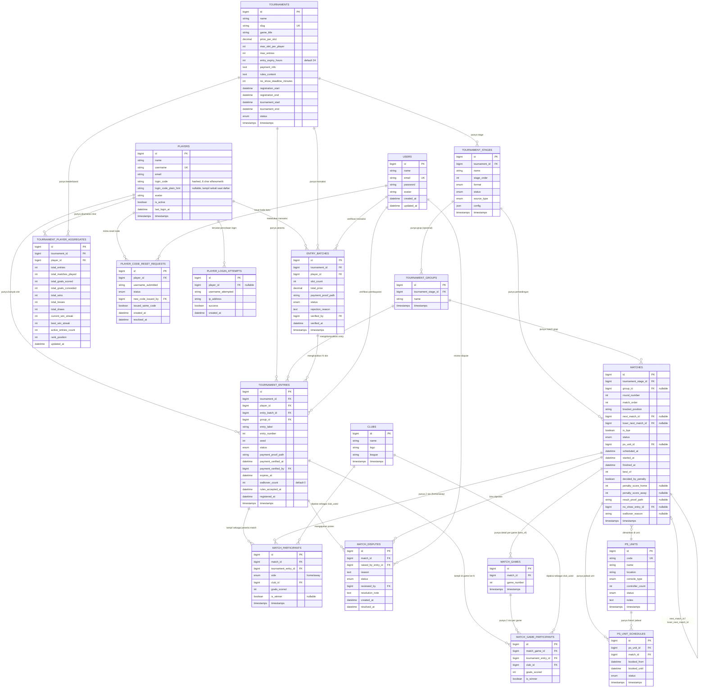

# ERD LENGKAP — TOURNAMENT MANAGEMENT SYSTEM (PS3/PLAYBOX)

**Versi:** 1.1 (update sesuai `tournament_system_design.md` v3.2)
**Database:** MySQL/MariaDB, Laravel 13 Eloquent

Dokumen ini merangkum SELURUH tabel yang sudah dibahas di dokumen alur sistem menjadi satu
ERD utuh & siap dipakai sebagai acuan migration.

---

## 1. DIAGRAM ERD (MERMAID)

---

## 2. PENJELASAN RELASI KUNCI

| Relasi | Kardinalitas | Catatan |
|---|---|---|
| `players` → `tournament_entries` | 1—N | Satu player bisa punya banyak entry/slot **dalam turnamen yang sama maupun berbeda** — inilah basis fitur multi-slot |
| `players` → `entry_batches` | 1—N | Riwayat transaksi pembelian slot, bisa lebih dari 1 batch per turnamen (daftar awal + tambah slot belakangan) |
| `entry_batches` → `tournament_entries` | 1—N | Satu transaksi bisa menghasilkan banyak entry sekaligus (sesuai jumlah slot yang dibeli) |
| `tournaments` → `tournament_stages` | 1—N | Default 1 stage (dibuat otomatis), bisa ditambah manual |
| `tournament_stages` → `tournament_groups` | 1—N | Hanya dipakai untuk format `round_robin`/`group_stage` |
| `tournament_stages` → `matches` | 1—N | Semua match berada di bawah satu stage |
| `matches` → `match_participants` | 1—2 | Selalu tepat 2 baris (home & away) per match, menggantikan kolom `entry_1/entry_2` agar fleksibel |
| `match_participants` → `clubs` | N—1 | Klub yang dipakai tiap sisi di match tsb, dasar query ranking klub terpopuler |
| `matches` → `matches` (self-relation) | N—1 | `next_match_id` (pemenang lanjut) & `loser_next_match_id` (untuk double elimination) |
| `tournament_entries` → `tournament_player_aggregates` | N—1 (lewat player_id+tournament_id) | Banyak entry milik 1 player diakumulasikan jadi 1 baris aggregate per turnamen |
| `matches` → `match_disputes` | 1—N | Satu match bisa diprotes lebih dari sekali (misal dari sisi berbeda) |
| `users` → `tournament_entries` | 1—N | `payment_verified_by` — admin verifikasi pembayaran entry |
| `users` → `entry_batches` | 1—N | `verified_by` — admin verifikasi transaksi |
| `users` → `match_disputes` | 1—N | `reviewed_by` — admin review & putuskan dispute |
| `users` → `player_code_reset_requests` | 1—N | `new_code_issued_by` — admin terbitkan kode baru |
| `clubs` → `match_game_participants` | 1—N | Klub dipakai di game individual (best_of) |
| `ps_units` → `matches` | 1—N | Satu unit dipakai bergantian oleh banyak match dari waktu ke waktu |

---

## 3. CATATAN IMPLEMENTASI MIGRATION

1. **Urutan migration disarankan** (mengikuti dependency FK): `users` (bawaan Laravel) → `players` →
   `clubs` → `ps_units` → `tournaments` → `tournament_stages` → `tournament_groups` →
   `entry_batches` → `tournament_entries` → `matches` (tanpa FK self dulu, lalu `alter table`
   tambah `next_match_id`/`loser_next_match_id` belakangan karena self-referencing) →
   `match_participants` → `match_games` → `match_game_participants` → `match_disputes` →
   `tournament_player_aggregates` → `ps_unit_schedules` → `player_login_attempts` →
   `player_code_reset_requests`.
2. **Model `GameMatch`**, bukan `Match` — `match` adalah reserved keyword di PHP 8.
3. Kolom `club_used` versi sebelumnya (free text) sudah dinormalisasi jadi `club_id` (FK ke
   `clubs`) di ERD final ini, supaya ranking klub akurat (tidak ada duplikasi penulisan
   "Real Madrid" vs "real madrid" vs "RealMadrid").
4. Tabel `activity_log` (dari package `spatie/laravel-activitylog`) tidak digambar di ERD
   karena dibuat otomatis oleh package tsb, bukan tabel custom — cukup tambahkan trait
   `LogsActivity` di model `TournamentEntry`, `GameMatch`, `MatchParticipant`, `EntryBatch`.
5. Semua tabel berstatus enum disarankan pakai native MySQL `ENUM` atau Laravel cast `enum`
   (PHP 8.1+ backed enum) supaya validasi status konsisten di level database & aplikasi.
6. Kolom `player_id` di `player_login_attempts` bersifat **nullable** karena percobaan login
   bisa dilakukan dengan username yang tidak dikenal (belum terdaftar) — lihat 2.1 desain sistem.
7. Tabel `users` (default Laravel) ditambahkan ke ERD karena direferensikan sebagai FK di
   beberapa tabel: `tournament_entries.payment_verified_by`, `entry_batches.verified_by`,
   `match_disputes.reviewed_by`, dan `player_code_reset_requests.new_code_issued_by`.
8. Field `login_code_plain_hint` di `players` bersifat sementara (nullable) — hanya diisi saat
   pertama kali generate kode untuk ditampilkan ke user, TIDAK disimpan permanen (segera di-null
   setelah ditampilkan). Ini sesuai catatan keamanan di desain sistem 3.3.
9. Field `entry_expiry_hours` di `tournaments` (default 24) mengatur batas waktu pembayaran
   entry `pending_payment` — lihat 3.2.2 desain sistem.
10. Field `payment_proof_path`, `payment_verified_at`, `payment_verified_by`, `expires_at`,
    dan `walkover_count` ditambahkan ke `tournament_entries` sesuai spesifikasi 2.2 desain sistem.
11. Relasi `clubs` → `match_game_participants` ditambahkan karena `match_game_participants`
    memiliki FK `club_id` (sama seperti `match_participants`).
