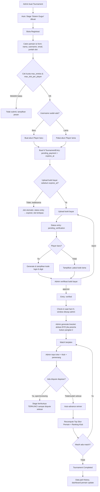
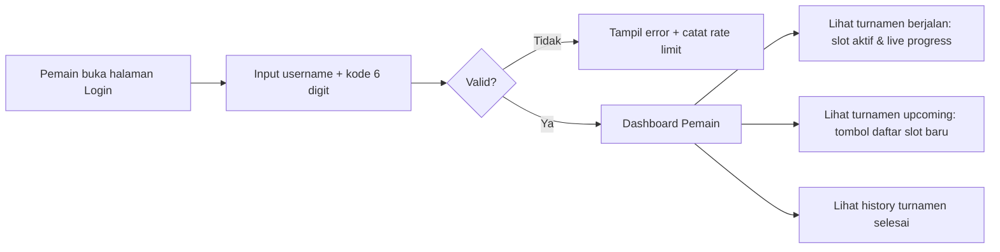

# RENCANA ALUR SISTEM — INFINITY BOXZONE — TOURNAMENT MANAGEMENT SYSTEM (PS3/PLAYBOX)

**Versi:** 3.2 (klarifikasi multi-turnamen bersamaan + fitur rekap akhir turnamen)
**Tech Stack:** Laravel 13, PHP 8.3.31, Filament v3 (admin panel), MySQL/MariaDB
**Perubahan utama dari v1.0:**
1. Stage bersifat fleksibel multi-stage, tapi **default 1 stage (sistem gugur/knockout)** saat tournament dibuat.
2. Ada **Top Skor per Pemain (akumulasi lintas slot)** — bukan per entry, tapi dijumlah dari semua slot milik pemain yang sama.
3. Alur **registrasi publik mandiri** (nama, username, email, jumlah slot) + upload bukti bayar → dapat **kode login 6 digit**.
4. **Login pemain** pakai username + kode 6 digit → dashboard sederhana (status, slot aktif, live progress).
5. Akun pemain **persisten lintas turnamen** (1x daftar, dipakai berulang), tapi progres/slot **scoped per turnamen** (reset tampilan saat turnamen baru, history tetap tersimpan).
6. **Halaman publik** (tanpa login): live bagan, live top skor, live win streak, pemain yang sedang main, ranking klub/tim terpopuler.
7. Saat input hasil match, admin juga mencatat **klub/tim yang dipakai** tiap slot.

**Perubahan utama v3.0 → v3.1 (hasil analisis simulasi peran Pemain & Admin):**
1. **Entry pending tanpa bukti bayar kini punya expiry** (`expires_at`) supaya slot "hantu" tidak mengunci `max_entries` selamanya — lihat 3.2.2.
2. **Validasi `max_slot_per_player` ditegaskan eksplisit** di alur daftar awal maupun tambah slot — lihat 3.2 & 3.2.1.
3. **Alur BYE eksplisit** untuk jumlah peserta yang bukan pangkat 2 (sangat umum di turnamen offline) — lihat 3.11.
4. **Dispute mengunci proses generate stage berikutnya** selama masih berstatus `open`/`reviewing`, supaya tidak ada bracket lanjutan dibangun di atas hasil yang masih disengketakan — lihat 3.7 & 3.13.
5. **Prosedur konkret koreksi skor berantai** (cascading correction) kalau dispute upheld setelah match turunannya sudah selesai duluan — lihat 3.7.1.
6. **Walkover kedua dilacak otomatis** lewat kolom `walkover_count`, bukan sekadar catatan kebijakan tanpa mekanisme — lihat 2.2 & 3.8.
7. **Aturan eksplisit leaderboard publik**: pemain yang seluruh slotnya sudah gugur tetap tampil di "Top Skor" (akumulasi historis), tapi hilang dari "Sedang Bermain" — ditegaskan di 3.5.
8. **Aturan unit PS nganggur saat pemain belum hadir** di antrian FIFO — lihat 3.10.

**Perubahan utama v3.1 → v3.2 (menjawab pertanyaan: multi-turnamen & rekap akhir):**
1. **Konfirmasi & klarifikasi dukungan multi-turnamen bersamaan** — sudah didukung skema sejak
   awal, tapi aturan antrian PS Unit lintas turnamen kini ditulis eksplisit — lihat 3.10.1.
2. **Fitur baru: Rekap Akhir Turnamen (Tournament Recap)** — halaman podium, statistik, bagan
   final, dan riwayat perjalanan per pemain, otomatis tersedia begitu turnamen `completed`,
   tanpa perlu tabel baru (murni query terhadap data yang sudah ada) — lihat 3.4.1.

---

## 1. KONSEP INTI & ISTILAH (Update)

| Istilah | Penjelasan |
|---|---|
| **Tournament** | Satu event turnamen |
| **Stage** | Tahapan turnamen. **Default: 1 stage bertipe "Sistem Gugur" otomatis dibuat saat tournament dibuat.** Admin bisa pecah jadi banyak stage (misal: Stage 1 "Penyisihan" knockout, Stage 2 "Perempat Final" dibuat manual terpisah, Stage 3 "Final" terpisah) jika ingin kontrol lebih granular per babak. |
| **Player (Akun Pemain)** | Akun global & persisten milik 1 manusia. Punya `username` (unik selamanya) dan `login_code` (6 digit, persisten, dipakai berulang di turnamen manapun). |
| **Tournament Entry (Slot)** | Satu tiket main milik 1 Player dalam 1 Tournament. Player bisa punya banyak Entry dalam turnamen yang sama, **dibatasi `max_slot_per_player` jika diisi admin**. Entry yang belum dibayar (`pending_payment`) **punya batas waktu (`expires_at`)** — lihat 3.2.2. |
| **Player Tournament Aggregate** | Data akumulasi (total skor, menang/kalah, win streak) milik 1 Player **dalam 1 Tournament**, dihitung dari **gabungan semua Entry/slot** milik Player tsb di turnamen itu. Inilah basis "Top Skor Pemain". |
| **Match Participant** | Representasi 1 sisi (entry) dalam 1 Match, mencatat skor & **klub/tim yang dipakai** pada match tsb (tim bisa beda tiap match karena entry yang sama bisa pilih klub berbeda tiap pertandingan). |
| **PS Unit** | Unit fisik PS3/Playbox |

---

## 2. ENTITY RELATIONSHIP DESIGN (Update)

### 2.1 Akun & Identitas Pemain

```
players                                  -- AKUN GLOBAL & PERSISTEN
├─ id
├─ name                  (nama lengkap)
├─ username              (unique, dipakai login selamanya)
├─ email
├─ login_code            (string 6 karakter ALFANUMERIK, hashed di DB — persisten, dipakai ulang)
├─ login_code_plain_hint (nullable, hanya dipakai sekali saat generate utk ditampilkan ke user via halaman sukses,
│                          TIDAK disimpan plain permanen demi keamanan — lihat catatan keamanan di 3.3)
├─ avatar (nullable)
├─ is_active (bool)
├─ last_login_at
├─ timestamps

player_login_attempts                    -- rate limiting brute-force kode 6 digit
├─ id, player_id (nullable), username_attempted, ip_address, success (bool), created_at

player_code_reset_requests               -- log permintaan reset kode lewat admin (alur WA)
├─ id
├─ player_id (FK, nullable jika username belum ketemu)
├─ username_submitted
├─ status (enum: requested, code_issued, completed)
├─ new_code_issued_by (FK users, nullable)
├─ issued_same_code (bool)        -- true jika admin pilih pakai kode lama, false jika generate baru
├─ created_at, resolved_at
```

### 2.2 Turnamen, Stage, Entry

```
tournaments
├─ id, name, slug, game_title
├─ price_per_slot (decimal, nullable)   -- harga per slot, dipakai utk hitung total saat daftar maupun saat beli tambahan slot
├─ max_slot_per_player (int, nullable)
├─ max_entries (int, nullable)
├─ entry_expiry_hours (int, default 24)  -- batas waktu entry pending_payment sebelum
│                                            otomatis expired & slotnya dilepas kembali (lihat 3.2.2)
├─ payment_info (text — no rekening/QRIS info ditampilkan saat registrasi)
├─ registration_start, registration_end
├─ tournament_start, tournament_end
├─ status (enum: draft, registration_open, registration_closed, ongoing, completed, cancelled)
├─ timestamps

tournament_stages
├─ id, tournament_id (FK)
├─ name                  (default auto: "Sistem Gugur" saat tournament dibuat)
├─ stage_order (int)
├─ format (enum: single_elimination, double_elimination, round_robin, group_stage)
│      -- default = single_elimination, dibuat otomatis via Observer saat Tournament::created
├─ status (enum: pending, ongoing, completed)
├─ source_type (enum: registration, previous_stage_winners, previous_stage_top_n)
│      -- menentukan entry stage ini berasal dari pendaftaran langsung (stage pertama)
│         atau hasil saringan stage sebelumnya (misal "Perempat Final" diisi dari
│         4 pemenang Stage sebelumnya secara manual/otomatis)
├─ config (json)
├─ timestamps

tournament_entries
├─ id, tournament_id (FK), player_id (FK)
├─ entry_label            (auto: "{username} #1", "{username} #2", dst)
├─ entry_number (int)
├─ seed (int, nullable)
├─ status (enum: pending_payment, pending_verification, verified, checked_in,
│                active, eliminated, disqualified, withdrawn, champion, expired)
├─ payment_proof_path     (file bukti transfer/screenshot)
├─ payment_verified_at, payment_verified_by (FK users, nullable)
├─ expires_at             (datetime, nullable — diisi otomatis = created_at + X jam saat entry
│                            dibuat dengan status pending_payment; lihat 3.2.2. NULL setelah
│                            entry verified, karena sudah tidak relevan lagi)
├─ walkover_count (int, default 0)   -- jumlah kali entry ini kena walkover di turnamen ini,
│                                        dipakai utk auto-disqualify pada walkover kedua (lihat 3.8)
├─ registered_at
├─ timestamps
```

### 2.3 Akumulasi Skor Per Pemain (TOP SKOR) — Tabel Baru Kunci

```
tournament_player_aggregates             -- 1 baris per (tournament_id, player_id)
├─ id
├─ tournament_id (FK)
├─ player_id (FK)
├─ total_entries (int)            -- jumlah slot yang diambil pemain ini di turnamen ini
├─ total_matches_played (int)
├─ total_goals_scored (int)       -- AKUMULASI dari seluruh slot/entry milik player ini
├─ total_goals_conceded (int)
├─ total_wins, total_losses, total_draws (int)
├─ current_win_streak (int)       -- dihitung lintas slot berdasarkan urutan waktu match selesai
├─ best_win_streak (int)
├─ active_entries_count (int)     -- slot yang masih hidup (belum eliminated) saat ini
├─ rank_position (int, nullable)  -- cache ranking top skor, direcompute tiap match selesai
├─ updated_at
```

**Mekanisme update:** setiap event `MatchCompleted`, listener `UpdatePlayerAggregate` mengambil `player_id` dari tiap `match_participant` yang terlibat, lalu **menjumlahkan ulang** (atau increment) baris `tournament_player_aggregates` milik player tsb untuk `tournament_id` itu. Karena 1 player bisa punya banyak entry, query dasarnya:

```sql
SELECT te.player_id, SUM(mp.goals) as total_goals, COUNT(*) as total_matches, ...
FROM match_participants mp
JOIN tournament_entries te ON te.id = mp.tournament_entry_id
WHERE te.tournament_id = ?
GROUP BY te.player_id
```
Bisa dijalankan sebagai recompute job (queued, debounced) tiap match selesai agar leaderboard near-real-time tanpa membebani request.

### 2.4 Match & Tim/Klub yang Dipakai

```
matches  (alias model: GameMatch, hindari reserved word `match`)
├─ id, tournament_stage_id (FK), group_id (nullable)
├─ round_number, match_order, bracket_position
├─ next_match_id, loser_next_match_id (nullable)
├─ is_bye (bool)
├─ status (enum: pending, ready, scheduled, ongoing, completed, walkover, disputed, cancelled)
├─ ps_unit_id (FK, nullable)
├─ scheduled_at, started_at, finished_at
├─ best_of (int, default 1)
├─ decided_by_penalty (bool, default false)
├─ penalty_score_home (int, nullable)
├─ penalty_score_away (int, nullable)
├─ timestamps

match_participants                        -- ganti pendekatan entry_1/entry_2 fixed-column
├─ id, match_id (FK)
├─ tournament_entry_id (FK)               -- slot/entry yang main
├─ side (enum: home, away)
├─ club_used                              -- NAMA KLUB/TIM yang dipakai pemain di match ini
│                                            (free text atau FK ke tabel master `clubs` — disarankan FK,
│                                             lihat 2.5, supaya nama klub konsisten utk ranking)
├─ goals_scored (int)
├─ is_winner (bool, nullable)             -- null jika belum selesai/seri/walkover
├─ timestamps

match_games                               -- detail per game jika best_of > 1 (opsional, sama seperti v1)
├─ id, match_id, game_number, timestamps
match_game_participants
├─ id, match_game_id, tournament_entry_id, club_used, goals_scored, is_winner
```

### 2.5 Master Klub/Tim & Ranking Klub Terpopuler

```
clubs                                     -- master data klub/tim yang tersedia di game
├─ id, name (misal "Real Madrid", "Arsenal"), logo (nullable), league (nullable), timestamps
```
**Sumber data:** di-seed awal lewat Laravel Seeder (`ClubSeeder.php`, daftar klub populer
dari game yang dipakai, misal liga-liga utama eFootball/FIFA), DAN tetap disediakan
`ClubResource` di Filament agar admin bisa tambah/edit/hapus klub manual kapan saja
(misal klub baru yang belum ke-seed, atau klub liga lokal).

```
-- Ranking "klub paling sering dipakai" cukup dihitung dari agregasi match_participants.club_used,
-- TIDAK perlu tabel tambahan, query langsung:
SELECT club_used, COUNT(*) as total_pemakaian
FROM match_participants
WHERE tournament_id = ? (join via match/stage)
GROUP BY club_used
ORDER BY total_pemakaian DESC
```
Bisa juga dibuat materialized cache `club_usage_stats (tournament_id, club_id, usage_count)` jika data besar dan butuh performa, di-recompute via listener `MatchCompleted` yang sama.

### 2.6 PS Unit (tetap sama seperti v1)

```
ps_units (id, code, name, location, console_type, status, ...)
ps_unit_schedules (id, ps_unit_id, match_id, booked_from, booked_until, status)
```

---

### 2.7 Integritas Match: Bukti Hasil & Dispute

```
matches
├─ ... (field sebelumnya)
├─ result_proof_path          (screenshot layar hasil akhir match — WAJIB diisi sebelum
│                                match bisa berstatus completed)
├─ no_show_entry_id (FK tournament_entries, nullable)  -- diisi jika match diselesaikan via walkover
├─ walkover_reason (nullable)

match_disputes
├─ id, match_id (FK)
├─ raised_by_entry_id (FK tournament_entries)   -- entry/slot yang mengajukan protes
├─ reason (text)
├─ status (enum: open, reviewing, upheld, rejected)
├─ reviewed_by (FK users, nullable)              -- HARUS admin yang BERBEDA dari admin
│                                                    yang input skor awal (lihat 3.7)
├─ resolution_note (text, nullable)
├─ created_at, resolved_at
```

### 2.8 Audit Trail

Menggunakan package `spatie/laravel-activitylog` pada model-model krusial: `TournamentEntry`,
`GameMatch`, `MatchParticipant`, `EntryBatch`. Setiap perubahan status/skor/pemenang otomatis
tercatat di tabel `activity_log` bawaan package (causer, subject, properties before/after,
timestamp) — tidak perlu tabel custom tambahan, cukup trait `LogsActivity` di tiap model terkait.

### 2.9 Persetujuan Aturan Turnamen (Rules Acceptance)

```
tournaments
├─ ... (field sebelumnya)
├─ rules_content (text/markdown — peraturan turnamen: format match, sanksi walkover,
│                  kebijakan dispute, jadwal, dll, ditulis admin saat setup turnamen)
├─ no_show_deadline_minutes (int, default 10 — batas waktu pemain dipanggil sebelum
│                              otomatis bisa di-set walkover oleh operator)

tournament_entries
├─ ... (field sebelumnya)
├─ rules_accepted_at (datetime, nullable)   -- diisi saat pemain centang setuju peraturan
│                                              sebelum submit pendaftaran
```

### 2.10 Role & Pemisahan Wewenang Admin

Menggunakan `filament-shield`, didefinisikan minimal 3 role (bisa lebih sesuai kebutuhan tim):

| Role | Wewenang |
|---|---|
| **Super Admin** | Akses penuh ke semua resource, termasuk kelola role lain |
| **Verifikator Pembayaran** | Hanya akses `EntryBatchResource` (approve/reject bukti bayar) |
| **Operator Match** | Hanya akses `MatchResource` (input skor, klub, walkover), `BracketBuilder`, `UnitMonitorDashboard` |

Pemisahan ini bersifat **rekomendasi minimal**; untuk organizer skala kecil (1-2 orang) boleh
digabung jadi 1 role, tapi sistem tetap menyediakan opsi pemisahan untuk skala lebih besar
demi mengurangi risiko tuduhan "atur skor sendiri".

---

## 3. ALUR SISTEM PER MODUL (Update)

### 3.1 Kelola Turnamen & Stage (Default 1 Stage)

```
[Admin] Create Tournament
   └─ Observer Tournament::created otomatis membuat
      TournamentStage #1 "Sistem Gugur" (format=single_elimination, source_type=registration)
        │
        ▼
[Admin] (opsional) Tambah stage baru jika ingin babak terpisah secara eksplisit, misal:
   - Stage 2 "Perempat Final" (source_type=previous_stage_winners, format=single_elimination)
   - Stage 3 "Final" (source_type=previous_stage_winners, format=single_elimination)
   Catatan: kalau admin TIDAK menambah stage apapun, satu Stage "Sistem Gugur" itu
   otomatis akan jalan dari Round 1 sampai Final dalam SATU bracket utuh (perilaku default
   turnamen knockout pada umumnya) — pemecahan jadi multi-stage hanya dibutuhkan kalau
   admin mau, misal, reset/atur ulang seeding manual di Perempat Final, atau ganti format
   stage tsb (misal Perempat Final tetap knockout tapi Final pakai best_of=3).
        │
        ▼
[Admin] Set status → registration_open
```

### 3.2 Registrasi Pemain (Self-Service Publik)

```
[Publik/Calon Pemain] Buka halaman registrasi turnamen yang registration_open
        │
        ▼
Isi form: nama, username, email, jumlah slot yang ingin diambil
   - Tampilkan ringkasan `tournaments.rules_content` + checkbox WAJIB "Saya setuju
     dengan peraturan turnamen ini" → tersimpan ke `rules_accepted_at` saat submit
   - Sistem cek apakah username SUDAH PERNAH ADA (akun lama)
   - **VALIDASI WAJIB:** jika `max_slot_per_player` diisi admin, sistem cek dulu total slot
     yang SUDAH dimiliki player ini di turnamen ini (untuk username lama) + slot baru yang
     diminta. Jika melebihi batas → tolak submit, tampilkan pesan jelas
     ("Maksimal {max_slot_per_player} slot per pemain, kamu sudah punya {existing} slot")
   - **VALIDASI WAJIB:** jika `max_entries` turnamen diisi, sistem hitung entry yang BUKAN
     `expired`/`withdrawn`/`rejected` (lihat 3.2.2) terhadap kuota tsb sebelum izinkan submit
        │
        ├── Username BARU → buat Player baru (status awal: belum punya login_code)
        │
        └── Username SUDAH ADA → pakai akun Player lama (tidak buat akun baru),
            tapi tetap minta isi ulang field agar admin punya record terbaru
        │
        ▼
Sistem hitung total biaya = price_per_slot × jumlah_slot, tampilkan info pembayaran
   (no rekening/QRIS dari tournaments.payment_info)
        │
        ▼
[Pemain] Submit → sistem buat N baris TournamentEntry (status=pending_payment,
   expires_at = now() + tournaments.entry_expiry_hours)
        │
        ▼
[Pemain] WAJIB upload foto/screenshot bukti bayar
   (form upload muncul langsung setelah submit, atau via link unik yang diberikan)
        │
        ▼
Sistem simpan payment_proof_path di SEMUA entry baru tsb, ubah status → pending_verification
        │
        ▼
Sistem generate/ambil login_code (6 karakter alfanumerik):
   - Jika Player baru → generate kode 6 karakter alfanumerik acak (huruf besar+angka, hindari
     karakter ambigu seperti 0/O dan 1/I/l), simpan (hashed) ke players.login_code,
     TAMPILKAN SEKALI ke layar konfirmasi ("simpan baik-baik, dipakai login seterusnya")
   - Jika Player lama (sudah punya kode) → TIDAK generate baru, cukup tampilkan pesan
     "gunakan kode login yang sudah kamu punya sebelumnya untuk masuk"
        │
        ▼
[Admin] Cek dashboard "Verifikasi Pembayaran" → lihat bukti bayar tiap entry
   - Approve → SEMUA entry dalam satu batch pendaftaran tsb berubah status = verified sekaligus
   - Reject  → SEMUA entry dalam satu batch tsb kembali ke pending_payment + catatan alasan
               (reject berlaku per BATCH pendaftaran/pembelian, bukan per slot individual —
               karena satu kali bayar mencakup semua slot yang diambil dalam transaksi itu)
               Pemain bisa upload ulang bukti via dashboard login-nya untuk batch yang sama
```

### 3.2.1 Alur Tambah Slot / Beli Slot Tambahan (Pemain yang Sudah Terdaftar)

Karena setiap pembelian (baik saat daftar pertama kali maupun nambah slot belakangan) selalu
butuh bukti bayar terpisah, sistem memodelkan tiap transaksi sebagai satu **batch pembelian**:

```
entry_batches                              -- 1 baris per transaksi pembayaran
├─ id, tournament_id (FK), player_id (FK)
├─ slot_count (int)               -- jumlah slot yang dibeli dalam transaksi ini
├─ total_price (decimal)          -- price_per_slot × slot_count (snapshot harga saat transaksi)
├─ payment_proof_path
├─ status (enum: pending_payment, pending_verification, verified, rejected)
├─ rejection_reason (nullable)
├─ verified_by (FK users, nullable), verified_at
├─ timestamps

tournament_entries
├─ ... (field sebelumnya)
├─ entry_batch_id (FK entry_batches)     -- tiap entry tahu dia berasal dari batch mana
```

```
[Pemain sudah login] Buka turnamen yang sedang diikuti → klik "Tambah Slot"
        │
        ▼
Input jumlah slot tambahan → sistem hitung total = price_per_slot × jumlah
   - **VALIDASI WAJIB (sama seperti 3.2):** total slot (existing aktif + slot baru ini)
     tidak boleh melebihi `max_slot_per_player` jika diisi. Slot `expired`/`withdrawn`/
     `rejected` TIDAK dihitung sebagai existing — pemain boleh coba lagi.
        │
        ▼
Buat entry_batches baru (status=pending_payment) + N TournamentEntry baru
   terhubung ke batch ini (status=pending_payment, expires_at = now() + entry_expiry_hours)
        │
        ▼
Upload bukti bayar → batch & entry-entry terkait → status=pending_verification
        │
        ▼
Admin verifikasi BATCH ini (approve/reject) → semua entry di batch ini ikut berubah status
   bersamaan (approve→verified semua, reject→pending_payment semua + alasan)
```
*(Catatan: batch pendaftaran pertama kali pun memakai struktur `entry_batches` yang sama,
jadi alur 3.2 di atas dan alur tambah slot di sini konsisten satu mekanisme.)*
```

**Catatan keamanan kode 6 karakter:** alfanumerik 6 karakter (huruf+angka, tanpa karakter ambigu) sudah jauh lebih aman dibanding 6 digit angka murni (jutaan kombinasi lebih banyak), tapi tetap WAJIB ada:
- Rate limiting login (misal max 5 percobaan / 15 menit / IP, dicatat di `player_login_attempts`)
- Lockout sementara setelah gagal berkali-kali
- Kode disimpan **hashed** (bcrypt) di DB, bukan plain text
- Pertimbangkan kombinasi alfanumerik 6 karakter (bukan hanya angka) untuk keamanan lebih baik jika memungkinkan dari sisi UX

### 3.2.2 Expiry Entry yang Belum Dibayar (Mencegah Slot "Hantu")

**Masalah yang dicegah:** tanpa batas waktu, pemain bisa submit form pendaftaran (membuat
N entry `pending_payment`) lalu tidak pernah lanjut upload bukti bayar. Entry-entry ini tetap
menghitung kuota `max_entries`, sehingga pemain lain yang serius bisa kehabisan slot padahal
slot itu sebenarnya tidak pernah benar-benar dibayar.

```
Scheduled Job (jalan tiap beberapa menit, mis. tiap 15 menit via Laravel Scheduler):
   └─ Cari semua tournament_entries dengan status=pending_payment DAN expires_at < now()
        │
        ▼
   Untuk tiap entry yang lolos kondisi tsb:
   - Ubah status → expired
   - Jika entry ini bagian dari entry_batches yang SEMUA entry-nya kini expired,
     ubah juga entry_batches.status → rejected (rejection_reason = "Kadaluarsa, tidak
     ada bukti bayar dalam batas waktu")
   - Slot ini OTOMATIS terlepas dari hitungan kuota max_entries & max_slot_per_player
     (karena query kuota selalu exclude status expired/withdrawn/rejected — lihat 3.2 & 3.2.1)
        │
        ▼
   (Opsional, jika integrasi WA aktif) Kirim notifikasi ke pemain: "Pendaftaranmu di
   {tournament} sudah kadaluarsa karena belum ada bukti bayar, silakan daftar ulang
   jika masih ingin ikut"
```

**Catatan implementasi:** entry yang SUDAH `pending_verification` (sudah upload bukti bayar,
tinggal menunggu admin verifikasi) **TIDAK** kena expiry — `expires_at` hanya relevan untuk
status `pending_payment`. Begitu pemain upload bukti bayar, set `expires_at = null` supaya job
ini tidak salah meng-expire entry yang sebenarnya sudah menunggu verifikasi admin.


### 3.3 Login & Dashboard Pemain

```
[Pemain] Buka halaman login publik → isi username + kode 6 digit
        │
        ▼
Sistem validasi (cek rate limit dulu) → cocokkan hash kode
        │
        ├── Gagal → catat ke player_login_attempts, tampilkan error generik
        │
        └── Berhasil → buat session pemain (guard terpisah "player", bukan guard admin Filament)
        │
        ▼
Tampil "Dashboard Pemain" sederhana:
   - Info akun: nama, username
   - Daftar turnamen yang SEDANG BERLANGSUNG dan pemain ini terdaftar di dalamnya
     → tiap turnamen tampilkan: jumlah slot aktif, status tiap slot (masih hidup/gugur),
       live progress (sedang di match ke berapa / lawan siapa / di unit PS mana)
   - Akumulasi skor turnamen ini (dari tournament_player_aggregates)
   - Daftar turnamen UPCOMING (registration_open) yang BELUM diikuti pemain ini →
     tombol "Daftar / Ambil Slot Lagi" → reuse akun yang sama, langsung ke alur 3.2
     tanpa perlu isi ulang nama/email (sudah terisi otomatis dari akun)
   - History ringkas turnamen yang sudah selesai diikuti (read-only, "track record")
```

### 3.3.1 Alur Lupa Kode Login (via Admin/WhatsApp)

```
[Pemain] Klik "Lupa Kode Login" di halaman login
        │
        ▼
Sistem redirect ke WhatsApp admin (wa.me link dengan pesan template ter-prefill,
   misal "Halo admin, saya lupa kode login. Username saya: ____")
        │
        ▼
[Pemain] Kirim pesan WA ke admin, isi/lengkapi username miliknya
        │
        ▼
[Admin] Cari Player berdasarkan username yang dikirim pemain
   - Buka PlayerResource di Filament → cari username → buka detail
        │
        ▼
[Admin] Pilih salah satu aksi:
   - "Generate Kode Baru" → sistem buat kode 6 karakter alfanumerik baru,
     simpan (hashed), tampilkan plain code SEKALI ke admin untuk disampaikan manual ke pemain
   - "Pakai Kode Lama" → admin tidak bisa lihat kode lama (karena di-hash), jadi opsi ini
     sebenarnya tidak applicable kecuali sistem juga menyimpan kode plain di tempat aman
     khusus admin (lihat catatan di bawah) — DEFAULT: admin generate kode baru saja,
     lebih aman dan lebih simpel
   - Sistem catat aksi ini ke `player_code_reset_requests` (status → code_issued)
        │
        ▼
[Admin] Sampaikan kode baru ke pemain via balasan WhatsApp manual
        │
        ▼
[Pemain] Masukkan username + kode baru dari admin di halaman login → berhasil masuk
        │
        ▼
Sistem update player_code_reset_requests.status = completed
```

**Catatan desain:** karena kode di-hash (best practice keamanan), opsi "pakai kode lama" secara teknis hanya mungkin jika admin sengaja menyimpan salinan plain text di kolom terenkripsi terpisah (`login_code_plain_encrypted`, pakai Laravel encrypted cast) khusus untuk kebutuhan support semacam ini. Ini trade-off keamanan vs kenyamanan — disarankan default-nya **selalu generate kode baru saat reset** agar tidak perlu menyimpan kode plain sama sekali. Jika Oscar tetap ingin opsi "pakai kode lama", tabel `players` perlu kolom tambahan `login_code_plain_encrypted` (encrypted, bukan hashed) yang hanya admin bisa lihat lewat panel khusus.

### 3.4 Scoping Progres Per-Turnamen (Persisten vs Sementara)

Prinsip desain: **Player itu permanen, Entry & Aggregate itu scoped per Tournament.**

```
Saat Tournament.status berubah → completed:
   - tournament_entries TIDAK dihapus, tetap status terakhir (champion/eliminated/dst) → jadi HISTORY
   - tournament_player_aggregates TIDAK dihapus → jadi HISTORY skor pemain di turnamen tsb
   - Dashboard pemain otomatis berhenti menampilkan turnamen itu di bagian "sedang berlangsung",
     pindah ke bagian "history" (read-only)
   - Tidak ada "reset data" sungguhan — yang berubah hanya TAMPILAN (query filter by status),
     jadi semua data tetap bisa dipakai utk statistik jangka panjang/leaderboard all-time nanti
```

### 3.4.1 Rekap Akhir Turnamen (Tournament Recap & Hall of Fame)

**Masalah yang diselesaikan di sini:** v3.0 hanya bilang data "jadi history" tanpa menjelaskan
APA yang sebenarnya ditampilkan ke pemain/publik setelah turnamen selesai. Tanpa halaman rekap
yang jelas, hasil kerja keras turnamen (data match, skor, dispute yang sudah diselesaikan, dst)
hanya tersimpan di database tapi tidak pernah benar-benar "ditampilkan" sebagai hasil akhir
yang layak dibagikan/diumumkan — padahal inilah momen paling penting secara sosial buat
peserta (lihat siapa juara, lihat ulang perjalanannya sendiri).

```
Event TournamentCompleted fire (saat admin set status Tournament → completed, biasanya
   setelah match Final selesai dan tidak ada dispute open tersisa)
        │
        ▼
Sistem otomatis generate/cache "Tournament Recap" — kombinasi data yang SUDAH ada di
   database, disusun jadi satu halaman ringkas (TIDAK perlu tabel baru, murni query
   terhadap data yang sudah tersimpan):

   1. PODIUM
      - Juara 1: entry dengan status=champion
      - Juara 2: entry kalah di match Final (runner-up)
      - Juara 3 / Semifinalis: entry kalah di match Semifinal (jika format mendukung,
        opsional ada "perebutan juara 3" atau langsung dianggap bersama di posisi 3-4)

   2. PENGHARGAAN STATISTIK (dari tournament_player_aggregates, snapshot final)
      - Top Skor: total_goals_scored tertinggi
      - Win Streak Terpanjang: best_win_streak tertinggi
      - (opsional, jika dibutuhkan) Best Defense: total_goals_conceded terendah
        dari pemain yang lolos minimal N match

   3. RANKING KLUB TERPOPULER (dari club_usage_stats / agregasi match_participants,
      lihat 2.5) — klub apa yang paling sering dipakai sepanjang turnamen ini

   4. BAGAN FINAL LENGKAP (read-only) — render ulang seluruh bracket dari Round 1
      sampai Final, dengan skor tiap match, sama seperti tab "Bagan Live" (3.5) tapi
      versi beku/final, tidak perlu polling lagi karena tidak ada perubahan

   5. RIWAYAT PERJALANAN PER PEMAIN ("My Tournament Journey")
      - Khusus terlihat di dashboard pemain yang bersangkutan (atau publik jika admin
        mengizinkan via halaman profil pemain) — daftar SETIAP match milik pemain ini
        di turnamen tsb, urut kronologis: Round berapa, lawan siapa, klub yang dipakai,
        skor, menang/kalah, link ke result_proof_path-nya
      - Ini murni query: SELECT semua match_participants milik entry-entry pemain ini
        DI tournament_id tsb, JOIN match untuk info round/lawan, ORDER BY match round_number
        — tidak perlu tabel baru

   6. RINGKASAN ADMINISTRATIF (khusus terlihat admin, bukan publik)
      - Total peserta terdaftar vs total yang check-in vs total yang withdrawn/disqualified
      - Total dispute yang masuk, berapa upheld vs rejected
      - Total walkover yang terjadi
      - Total pendapatan dari price_per_slot × jumlah entry verified (ringkasan keuangan
        kasar, BUKAN pembukuan lengkap — cukup untuk admin tahu performa turnamen ini)
        │
        ▼
Halaman publik /t/{slug}/recap (atau tab baru di halaman publik turnamen yang sudah
   completed) menampilkan poin 1-4 ke semua orang tanpa login, sebagai pengumuman resmi
   hasil akhir yang bisa di-screenshot/dibagikan ke media sosial peserta
        │
        ▼
Pemain yang login bisa lihat tambahan poin 5 (riwayat perjalanan pribadinya) di
   dashboard, di bagian "History" yang sudah disebut di 3.3 & 3.4
```

**Catatan implementasi:** karena seluruh data sumbernya sudah ada (tidak ada tabel baru
yang perlu dibuat), recap ini sebaiknya diimplementasikan sebagai READ MODEL / query service
(`TournamentRecapService.php`) yang dipanggil on-demand saat halaman recap diakses, BUKAN
data yang di-generate-dan-disimpan terpisah saat `TournamentCompleted` — supaya jika ada
koreksi data di kemudian hari (misal dispute yang baru ditemukan jauh setelah turnamen
selesai, kasus ekstrem), recap akan otomatis ikut akurat tanpa perlu regenerate manual.

### 3.5 Halaman Publik (Tanpa Login — Live Info)

```
Public Page per Tournament (mis. /t/{slug}):
   ├─ Tab "Bagan Live"        → render bracket dari matches + match_participants real-time
   ├─ Tab "Top Skor"          → ranking tournament_player_aggregates.total_goals_scored DESC
   │                             (tampilkan nama pemain, total slot, total gol akumulasi semua slot).
   │                             **Aturan eksplisit: pemain yang SEMUA slotnya sudah eliminated/
   │                             disqualified TETAP tampil di tab ini** — leaderboard ini murni
   │                             akumulasi historis gol, bukan indikator "masih hidup di turnamen".
   │                             Tab ini TIDAK pernah menyaring berdasarkan status entry.
   ├─ Tab "Win Streak"        → ranking current_win_streak DESC (dengan badge "🔥 on fire" dsb)
   ├─ Tab "Sedang Bermain"    → list match status=ongoing, join ps_unit utk tampilkan
   │                             "Match di PS-03: Budi #2 vs Andi #1". **Berbeda dengan tab
   │                             "Top Skor", tab ini OTOMATIS hanya berisi entry yang sedang
   │                             aktif bermain — pemain yang sudah gugur total wajar tidak
   │                             muncul di sini karena memang tidak sedang main.**
   └─ Tab "Ranking Klub"      → ranking pemakaian club_used (lihat query 2.5),
                                 misal "Real Madrid — dipakai 10x", "Arsenal — dipakai 5x"
```

Implementasi: halaman ini cukup **polling/refresh otomatis tiap 1 menit** (AJAX interval
60 detik, pakai `setInterval` di JS atau Livewire `wire:poll.60s`) — tidak perlu
WebSocket/Reverb untuk versi ini, karena update tiap 1 menit dianggap cukup real-time
untuk kebutuhan papan info turnamen offline.

### 3.6 Eksekusi Match & Perpindahan Antar-Stage (Update — Manual oleh Admin)

Karena tidak ada input score real-time dari sistem game otomatis, semua hasil match
dilaporkan manual oleh pemain ke admin (verbal/di lokasi), lalu admin yang mencatat ke sistem:

```
Match status=ready (2 entry sudah ditentukan via bracket) → di-assign ps_unit → status=ongoing
        │
        ▼
[Pemain] Selesai bertanding → lapor hasil ke admin (langsung di venue)
        │
        ▼
[Admin] Buka form input hasil match, isi:
   - Klub/tim yang dipakai tiap sisi (home & away)
   - Skor tiap sisi (skor normal waktu pertandingan)
   - JIKA pertandingan diselesaikan via ADU PENALTI (skor imbang di waktu normal):
     toggle "Selesai via Adu Penalti" → muncul field tambahan skor_penalti_home,
     skor_penalti_away (terpisah dari skor normal, TIDAK digabung ke goals_scored
     supaya statistik gol tetap akurat — penalti cuma dipakai utk menentukan pemenang,
     bukan dihitung sebagai gol pertandingan)
        │
        ▼
Sistem otomatis tentukan kandidat pemenang dari skor (skor normal lebih tinggi menang;
   jika imbang dan ada data penalti, pakai skor penalti)
        │
        ▼
[Admin] KONFIRMASI MANUAL siapa pemenangnya (admin pilih entry/slot pemenang
   dari dropdown, default ter-pre-select sesuai hasil otomatis di atas, tapi admin
   tetap bisa override jika diperlukan, misal kasus diskualifikasi)
        │
        ▼
Sistem simpan ke match_participants (home & away: club_used, goals_scored, is_winner)
   + simpan penalty_score_home/away di match jika ada (lihat update skema di bawah)
        │
        ▼
[Admin] Klik "Simpan & Lanjutkan" → Event MatchCompleted fire:
   - match.status = completed
   - ps_unit → available
   - RECOMPUTE tournament_player_aggregates (kedua player terkait)
   - RECOMPUTE club usage stats
        │
        ▼
JIKA match ini berada di Stage yang TIDAK auto-advance (source_type stage berikutnya =
   previous_stage_winners, dipindah MANUAL oleh admin — lihat 3.6.1) → next_match TIDAK
   otomatis terisi, menunggu aksi admin terpisah
JIKA stage saat ini auto-advance dalam satu bracket utuh (default, 1 stage besar) →
   winner_entry otomatis mengisi next_match slot kosong seperti biasa
```

### 3.6.1 Perpindahan Entry ke Stage Berikutnya (Manual oleh Admin)

Sesuai keputusan: ketika admin sengaja memecah turnamen jadi multi-stage terpisah
(misal Stage 1 "Penyisihan", Stage 2 "Perempat Final" beda stage), perpindahan entry
pemenang dari Stage 1 ke Stage 2 **TIDAK otomatis** — admin yang menentukan manual:

```
Stage 1 selesai (semua match completed) → status Stage 1 = completed
        │
        ▼
[Admin] Buka halaman "Kelola Stage Berikutnya" untuk Stage 2 (source_type=previous_stage_winners)
        │
        ▼
**GUARD WAJIB:** sistem cek dulu apakah ada `match_disputes` berstatus `open` atau `reviewing`
   pada match manapun di Stage 1. Jika ADA → tombol "Generate Bracket Stage 2" DINONAKTIFKAN,
   tampilkan peringatan "Masih ada {N} dispute belum diputuskan di Stage 1, selesaikan dulu
   sebelum lanjut ke stage berikutnya" + link langsung ke dispute terkait. Ini mencegah bracket
   Stage 2 dibangun di atas hasil yang masih berpotensi berubah (lihat 3.13).
        │
        ▼
Sistem tampilkan daftar entry yang status=active dari Stage 1 (kandidat lolos)
        │
        ▼
[Admin] PILIH MANUAL entry/slot mana saja yang lolos ke Stage 2
   (default: sistem sudah ceklis otomatis entry-entry yang punya status='active'/menang
   terakhir di Stage 1, tapi admin bebas centang/uncentang — fleksibel untuk kasus
   wildcard, entry tambahan, atau diskualifikasi mendadak)
        │
        ▼
[Admin] Klik "Generate Bracket Stage 2" dari entry-entry terpilih
   → BracketServiceFactory generate bracket baru untuk Stage 2 dari entry tsb
        │
        ▼
Stage 2 status → ongoing, entry yang tidak terpilih tetap berstatus terakhir mereka
   (eliminated) di Stage 1, tidak ikut campur di Stage 2
```

### 3.7 Alur Dispute / Protes Hasil Match

```
[Pemain] Login → buka detail match yang sudah completed miliknya → klik "Protes Hasil"
   (tombol hanya muncul dalam jangka waktu tertentu setelah match completed, misal 1 jam,
   supaya tidak ada protes basi berhari-hari kemudian)
        │
        ▼
Isi alasan protes (text) → submit → buat baris match_disputes (status=open)
        │
        ▼
Sistem notifikasi admin ada dispute baru
        │
        ▼
[Admin LAIN — bukan admin yang input skor awal match ini] buka dispute → status=reviewing
   - Cek result_proof_path (screenshot yang sudah diupload saat match diinput)
   - Cek activity_log perubahan match tsb jika ada
        │
        ▼
[Admin] Putuskan:
   - "Tolak" → status=rejected, skor/pemenang TETAP seperti semula
   - "Terima" → status=upheld → admin koreksi skor/pemenang match (tercatat di audit log
     sebagai perubahan baru, BUKAN overwrite diam-diam) → jika match sudah advance ke
     next_match, sistem beri PERINGATAN eksplisit ke admin bahwa koreksi ini berdampak
     ke bracket selanjutnya dan perlu ditinjau manual — **lihat prosedur konkret di 3.7.1**
```

### 3.7.1 Prosedur Koreksi Berantai (Cascading Correction) Saat Dispute Upheld

**Masalah yang diselesaikan di sini:** v3.0 hanya bilang "sistem beri peringatan" tanpa
prosedur teknis. Kasus nyata: match A sudah completed dengan pemenang yang ternyata salah
(dispute upheld), TAPI pemenang lama itu sudah lanjut main di match B (next_match) dan match B
**juga sudah completed**. Tanpa prosedur, admin tidak tahu harus apa terhadap match B dst.

```
Dispute match A status → upheld, admin ganti pemenang match A dari Entry-X menjadi Entry-Y
        │
        ▼
Sistem cek: apakah match A.next_match_id terisi DAN match tujuan (match B) statusnya
   SELAIN pending/ready (artinya match B sudah mulai/selesai berdasar pemenang lama)?
        │
        ├── TIDAK (match B masih pending/ready, entry belum diisi/belum main)
        │     → sistem otomatis GANTI slot pemenang di match B dari Entry-X ke Entry-Y,
        │       tidak ada dampak lanjutan, proses selesai otomatis
        │
        └── YA (match B sudah ongoing/completed) → STOP otomatisasi, sistem PAKSA admin
              masuk ke "Mode Peninjauan Berantai":
                │
                ▼
              Sistem tampilkan SELURUH match turunan yang terdampak (match B, dan jika match B
              juga sudah completed dan punya next_match C, tampilkan C, dst — ditelusuri
              rekursif sampai ujung bracket atau sampai match berstatus pending/ready)
                │
                ▼
              [Admin] WAJIB putuskan match per match secara manual, dari yang paling awal
              terdampak (match B dulu, baru C, dst), salah satu dari opsi tiap match:
              - "Batalkan & Main Ulang" → match.status = cancelled, buat ulang match baru
                kosong dengan Entry-Y di slot yang relevan, ps_unit dijadwalkan ulang
              - "Override Manual" → admin tahu persis hasil yang seharusnya terjadi
                (misal karena ada bukti match tsb hasilnya tidak berubah meski pesertanya
                beda), admin input ulang skor manual untuk match ini
                │
                ▼
              Setiap keputusan di "Mode Peninjauan Berantai" WAJIB tercatat di audit log
              dengan catatan eksplisit "koreksi berantai akibat dispute #{id}" supaya
              jejaknya jelas dan bisa dipertanggungjawabkan ke peserta lain
```

**Prinsip:** sistem TIDAK PERNAH mengoreksi otomatis match yang sudah completed di bawah
match yang didispute — keputusan itu terlalu sensitif untuk diotomatisasi dan harus selalu
ada keputusan eksplisit admin yang tercatat.

### 3.8 Alur Walkover / No-Show

```
[Operator] Match status=ready/scheduled, kedua entry dipanggil ke unit PS
        │
        ▼
Jika salah satu entry TIDAK HADIR melebihi `no_show_deadline_minutes` sejak dipanggil
        │
        ▼
[Operator] Klik "Set Walkover" pada match → pilih entry mana yang tidak hadir
        │
        ▼
Sistem otomatis:
   - match.status = walkover, no_show_entry_id terisi, walkover_reason (opsional diisi)
   - winner = entry yang hadir, goals_scored TIDAK diisi (bukan match sungguhan,
     tidak dihitung ke statistik gol/top skor, HANYA dihitung sebagai 1 win di aggregate)
   - entry yang no-show → `walkover_count` di tournament_entries bertambah +1
   - **JIKA `walkover_count` (setelah increment) >= 2** → entry otomatis status = disqualified
     (BUKAN eliminated) — aturan baku, tidak lagi opsional, supaya konsisten antar turnamen
     dan tidak ada kesan admin pilih-pilih kapan menerapkannya
   - **JIKA `walkover_count` (setelah increment) == 1** → entry status = eliminated seperti
     match kalah biasa (walkover pertama dianggap kesalahan wajar, bukan pelanggaran)
   - Auto-advance winner ke next_match seperti match normal
```

**Catatan:** ambang batas "2 kali walkover = disqualified" berlaku sebagai default sistem.
Admin tetap bisa override status entry secara manual dari Filament jika ada situasi khusus
(misal walkover kedua disebabkan masalah teknis di luar kendali pemain), perubahan manual
ini tetap tercatat di audit log.

### 3.9 Notifikasi ke Pemain

Untuk transparansi, sistem mengirim notifikasi (disarankan via WhatsApp API/Fonnte atau
sejenis, atau minimal badge "baru" di dashboard pemain jika belum ada budget WA API) pada
momen-momen berikut:
```
- Batch pembayaran diverifikasi (verified) atau ditolak (rejected) + alasan
- Match pemain dijadwalkan (scheduled_at terisi) + info unit PS
- Hasil match pemain tersimpan (menang/kalah) + ringkasan skor
- Dispute yang diajukan pemain sudah diputuskan (upheld/rejected)
- Entry pemain lolos ke stage berikutnya (saat admin generate bracket stage baru)
```
Implementasi awal cukup notifikasi in-app (badge/list di dashboard), integrasi WA API
bisa menyusul sebagai enhancement v2 jika dibutuhkan.

### 3.10 Antrian Penjadwalan PS Unit (Default Sistematis)

Supaya tidak ada kesan pilih kasih, assignment PS unit ke match memakai aturan **FIFO
otomatis** sebagai default, dengan admin tetap bisa override manual:

```
Match menjadi status=ready (kedua entry sudah ditentukan)
        │
        ▼
Sistem masukkan match ke "antrian siap main" (urut berdasarkan waktu match menjadi ready)
        │
        ▼
Begitu ada ps_unit berstatus=available → sistem otomatis assign match TERLAMA di antrian
   ke unit tsb (FIFO), generate notifikasi "Match X siap di Unit Y"
        │
        ▼
[Operator] Bisa override manual (drag-drop atau pilih langsung) HANYA jika ada alasan
   operasional (misal pemain minta unit tertentu karena settingan controller) — aksi
   override ini tercatat di audit log siapa & kenapa
```

**Aturan saat pemain di urutan terdepan antrian belum hadir di unit:** FIFO menentukan
match MANA yang diassign duluan ke unit, tapi assignment ini hanya memindahkan match dari
status `ready` ke `scheduled`/`ongoing` — bukan menjamin pemain langsung hadir fisik.

```
Match X (terdepan di antrian FIFO) di-assign ke Unit Y yang baru available
        │
        ▼
[Operator] Panggil kedua entry Match X ke Unit Y
        │
        ▼
Jika salah satu/kedua entry TIDAK HADIR melebihi `no_show_deadline_minutes`
        │
        ▼
Unit Y TIDAK dibiarkan menunggu tanpa batas — berlaku alur Walkover (3.8) seperti biasa
   pada Match X, sehingga Unit Y tetap bisa dipakai (entry yang hadir menang walkover,
   atau jika KEDUA entry tidak hadir, admin set Match X cancelled dan unit dilepas ke
   match berikutnya di antrian). Ini mencegah unit fisik nganggur lama hanya karena
   urutan FIFO kebetulan jatuh ke pemain yang belum datang ke venue.
```

### 3.10.1 Antrian PS Unit Lintas Banyak Turnamen Sekaligus (Multi-Tournament)

**Konfirmasi desain:** sistem MENDUKUNG banyak turnamen berjalan bersamaan (`status=ongoing`
di lebih dari satu baris `tournaments` pada waktu yang sama) tanpa perubahan skema — karena
hampir semua tabel inti (`tournament_entries`, `matches`, `entry_batches`, dll) sudah
ter-scope via `tournament_id`. Akun `players` memang sengaja global, jadi satu pemain bisa
ikut Tournament A dan Tournament B di periode yang sama tanpa konflik data.

**Satu-satunya resource yang DIBAGI antar turnamen adalah `ps_units` (unit fisik PS3/Playbox).**
Bagian 3.10 di atas menjelaskan FIFO dalam konteks satu turnamen; berikut aturan saat
beberapa turnamen aktif memperebutkan unit yang sama:

```
Tournament A (ongoing) punya Match A1 status=ready
Tournament B (ongoing, berjalan bersamaan) punya Match B1 status=ready
        │
        ▼
Keduanya masuk SATU antrian FIFO GLOBAL per ps_unit (bukan antrian terpisah per turnamen)
   — urutan murni berdasarkan kapan match menjadi `ready`, TANPA prioritas otomatis
   berdasarkan turnamen mana yang "lebih penting". Ini menjaga prinsip fair play yang sama
   seperti 3.10 (tidak ada kesan pilih kasih antar turnamen, bukan cuma antar pemain).
        │
        ▼
[Admin] BISA membatasi unit ke turnamen tertentu via field opsional pada PsUnitResource:
   `ps_unit_schedules` (sudah ada di ERD) dipakai untuk mencatat alokasi unit per match,
   sehingga riwayat siapa pakai unit mana kapan tetap tercatat lintas turnamen.
        │
        ▼
[Operator/Admin] Jika ingin DEDIKASI unit khusus per turnamen (misal "Unit PS-01 sampai
   PS-04 khusus Tournament A, PS-05 sampai PS-08 khusus Tournament B" — umum dilakukan di
   venue offline dengan banyak unit), admin set ini secara MANUAL melalui assignment
   override (3.10) — sistem tidak memaksakan partisi otomatis, karena kebutuhan venue
   bisa berbeda-beda (kadang justru mau semua unit fleksibel dipakai turnamen manapun).
```

**Catatan implementasi:** `PsUnitQueueService` perlu query antrian "siap main" secara GLOBAL
lintas `tournament_id` (bukan per-turnamen), supaya FIFO benar-benar adil lintas semua
turnamen aktif yang berbagi unit yang sama. Dashboard `UnitMonitorDashboard` (lihat Section 6)
sebaiknya tetap menampilkan label turnamen di tiap match yang sedang dimonitor, supaya admin
yang mengelola beberapa turnamen sekaligus tidak bingung match mana milik turnamen mana.

### 3.11 Penanganan BYE (Jumlah Peserta Bukan Pangkat 2)

**Masalah yang dicegah:** turnamen offline jarang punya peserta dengan jumlah pas pangkat 2
(8, 16, 32). Tanpa aturan eksplisit, generate bracket untuk 11 atau 13 peserta akan gagal atau
menghasilkan bracket yang salah/tidak seimbang. Kolom `is_bye` sudah ada di skema `matches`
sejak v1, tapi alurnya belum pernah ditulis — bagian ini melengkapinya.

```
[Admin] Klik "Generate Bracket" untuk sebuah Stage
        │
        ▼
Sistem hitung jumlah entry yang AKAN masuk bracket — yaitu entry dengan status `checked_in`
   pada saat generate dilakukan (lihat catatan check-in di bawah). Entry yang masih `verified`
   tapi BELUM check-in TIDAK diikutkan ke bracket sama sekali (dianggap belum konfirmasi hadir).
        │
        ▼
Sistem cari N_bracket = pangkat 2 terdekat YANG LEBIH BESAR ATAU SAMA DENGAN jumlah entry
   checked_in (mis. 11 peserta → N_bracket = 16)
        │
        ▼
Jumlah BYE yang dibutuhkan = N_bracket − jumlah_entry_checked_in (mis. 16 − 11 = 5 BYE)
        │
        ▼
BracketService mengalokasikan BYE ke entry dengan **seed TERTINGGI** terlebih dahulu
   (peserta unggulan/seed teratas dapat keuntungan BYE di Round 1 — konvensi standar turnamen).
   Jika seed belum diisi admin secara manual, sistem pakai urutan `registered_at` ASC sebagai
   fallback seed (pendaftar lebih awal dianggap "seed lebih tinggi").
        │
        ▼
Untuk tiap slot bracket yang dapat BYE: sistem buat Match dengan `is_bye = true`,
   `status = completed` langsung (tanpa perlu input admin), entry dengan BYE otomatis
   jadi `is_winner = true` TANPA mencatat goals_scored apapun (sama seperti walkover,
   match BYE TIDAK dihitung ke statistik gol/top skor pemain, hanya tercatat sebagai
   kemenangan otomatis di aggregate jika ingin ditampilkan "menang ronde 1")
        │
        ▼
Entry yang dapat BYE otomatis advance ke next_match Round 2 seperti pemenang match biasa
```

**Catatan penting soal check-in sebagai syarat masuk bracket:** karena BYE dihitung dari
jumlah entry `checked_in` (bukan semua entry `verified`), admin WAJIB menutup window check-in
(mis. tutup 15 menit sebelum jadwal mulai) sebelum klik "Generate Bracket", supaya jumlah
peserta final sudah pasti. Entry `verified` yang tidak sempat check-in otomatis TIDAK masuk
bracket sama sekali (bukan dianggap walkover Round 1, karena belum pernah ada match yang
dibuat untuknya) — statusnya tetap `verified`, bisa diubah manual oleh admin ke `withdrawn`
untuk kerapian data jika memang tidak hadir sama sekali di hari-H.

### 3.12 Tournament Entry Status `expired` (Tambahan Lihat 3.2.2)

Status `expired` adalah status akhir (final) untuk entry yang gagal bayar tepat waktu — tidak
bisa kembali ke `pending_payment`. Jika pemain masih ingin ikut setelah entry-nya expired,
alurnya adalah **daftar ulang dari awal** (submit form registrasi baru), bukan "memperpanjang"
entry yang sudah expired — ini menyederhanakan state machine dan menghindari ambiguitas
"entry mana yang aktif" kalau ada banyak percobaan daftar dari player yang sama.

### 3.13 Ringkasan Titik Kunci (Lock Points) Antar-Tahap

Beberapa transisi tahap kini punya guard eksplisit supaya proses tidak berjalan di atas
data yang masih belum final — ringkasan supaya tim implementasi (OpenCode) tidak melewatkan:

| Transisi | Guard / Syarat | Lihat |
|---|---|---|
| Generate Bracket Stage 1 | Window check-in sudah ditutup admin | 3.11 |
| Generate Bracket Stage berikutnya (multi-stage manual) | TIDAK ADA `match_disputes` berstatus `open`/`reviewing` di stage sebelumnya | 3.6.1, 3.7 |
| Match completed → masuk hitungan statistik | `result_proof_path` wajib terisi (sudah ada sejak v3.0) | 2.7, 3.6 |
| Entry ikut hitungan kuota `max_entries`/`max_slot_per_player` | Status BUKAN `expired`/`withdrawn`/`rejected` | 3.2, 3.2.1, 3.2.2 |
| Koreksi skor dispute yang match turunannya sudah completed | WAJIB lewat "Mode Peninjauan Berantai", tidak ada auto-correction | 3.7.1 |

---

## 4. STATE MACHINE (Update)

### 4.1 Tournament Entry Status (ditambah payment flow)
```
pending_payment → pending_verification → verified → checked_in → active ──┬──→ eliminated
                                                                              └──→ champion
pending_verification → pending_payment   (jika admin reject BATCH bukti bayar —
                                            berlaku utk SEMUA entry dalam batch tsb sekaligus)
pending_payment → expired                (otomatis via scheduled job, expires_at terlewati —
                                            status FINAL, tidak bisa kembali, lihat 3.2.2 & 3.12)
(sebelum checked_in) → withdrawn
(checked_in/active)  → disqualified      (manual oleh admin, ATAU otomatis saat walkover_count
                                            mencapai 2 — lihat 3.8)
eliminated (akibat walkover pertama, walkover_count=1)  -- tetap final seperti eliminated biasa
```

### 4.1.1 Entry Batch Status (transaksi pembayaran)
```
pending_payment → pending_verification → verified
pending_verification → rejected → (pemain upload ulang) → pending_verification
pending_payment → rejected   (otomatis jika SEMUA entry dalam batch ini expired — lihat 3.2.2)
```

### 4.2 Match Status (Update — Dispute, Walkover & BYE Eksplisit)
```
pending → ready → scheduled → ongoing → completed
ready/scheduled → cancelled
pending → completed   (HANYA untuk match is_bye=true — langsung completed otomatis saat
                        bracket digenerate, tanpa melalui ready/scheduled/ongoing, lihat 3.11)
completed → disputed (jika ada match_disputes baru status=open)
   disputed → completed (dispute rejected, skor tetap)
   disputed → completed (dispute upheld, skor dikoreksi admin, tercatat di audit log —
      JIKA match turunan sudah completed, lihat prosedur wajib di 3.7.1 sebelum status
      match turunan tsb boleh diubah)
ready/scheduled → walkover (no-show melebihi no_show_deadline_minutes — termasuk juga
   match yang KEDUA entry-nya tidak hadir, lihat 3.10 → dalam kasus ini admin pilih
   `cancelled` bukan `walkover`, karena tidak ada pemenang yang sah)
```

### 4.3 Tournament Status — tetap sama seperti v1
```
draft → registration_open → registration_closed → ongoing → completed
   └──→ cancelled (dari status manapun sebelum completed)
```
*(Status `bracket_generated` dari v1 sekarang melebur ke dalam `registration_closed`→`ongoing`, karena default stage sudah otomatis ada sejak awal — generate bracket tinggal aksi admin "Generate Bracket" dalam status `registration_closed` sebelum pindah ke `ongoing`.)*

---

## 5. DIAGRAM ALUR UTAMA (MERMAID)





---

## 6. STRUKTUR MODUL FILAMENT & APLIKASI (Update)

```
app/Filament/Resources/
├─ TournamentResource.php           (+ RelationManager: Stages, Entries, ClubUsageStats)
├─ TournamentEntryResource.php      (custom page: "Verifikasi Pembayaran" — list bukti bayar pending)
├─ EntryBatchResource.php           (kelola transaksi pembayaran per batch, approve/reject sekaligus)
├─ PlayerResource.php               (admin: lihat/reset akun, regenerate kode jika pemain lupa)
├─ ClubResource.php                 (master data klub/tim)
├─ PsUnitResource.php
├─ MatchResource.php                (custom action: input skor + klub + pemenang + walkover sekaligus)
├─ MatchDisputeResource.php         (review & putuskan protes hasil match)

app/Filament/Pages/
├─ BracketBuilder.php
├─ PaymentVerificationDashboard.php
├─ UnitMonitorDashboard.php
├─ PsUnitQueueDashboard.php         (antrian FIFO match siap main → unit available)

app/Http/Controllers/Public/         -- halaman publik non-Filament
├─ RegistrationController.php        (form daftar + checkbox setuju peraturan + upload bukti bayar)
├─ PlayerAuthController.php          (login username + kode 6 digit, guard terpisah)
├─ PlayerDashboardController.php     (+ aksi "Protes Hasil Match")
├─ TournamentPublicController.php    (live bagan, top skor, win streak, sedang bermain, ranking klub)
├─ TournamentRecapController.php     (halaman /t/{slug}/recap — podium, statistik, bagan final,
│                                       lihat 3.4.1, hanya aktif jika tournament.status=completed)

app/Services/
├─ Bracket/...                       (sama seperti v1, BracketService kini juga handle
│                                       alokasi BYE otomatis berdasarkan seed — lihat 3.11)
├─ PlayerCodeGenerator.php           (generate kode 6 karakter alfanumerik + hashing)
├─ PlayerAggregateService.php        (recompute tournament_player_aggregates)
├─ ClubUsageStatsService.php
├─ PsUnitQueueService.php            (assign FIFO match ready → unit available; antrian GLOBAL
│                                       lintas tournament_id supaya adil saat banyak turnamen
│                                       ongoing bersamaan berbagi unit yang sama — lihat 3.10.1)
├─ TournamentRecapService.php        (read model query-only: podium, top skor, ranking klub,
│                                       riwayat perjalanan per pemain — lihat 3.4.1, TIDAK
│                                       menyimpan data baru, selalu query live dari tabel asal)
├─ NotificationDispatcher.php        (kirim notifikasi in-app/WA pada momen-momen di 3.9)

app/Console/Commands/
├─ ExpireUnpaidEntries.php           (dipanggil scheduler tiap 15 menit, lihat 3.2.2)

app/Events/
├─ MatchCompleted.php, StageCompleted.php, TournamentCompleted.php
├─ EntryPaymentVerified.php, EntryPaymentRejected.php
├─ MatchDisputeRaised.php, MatchDisputeResolved.php, MatchWalkoverSet.php
├─ TournamentEntryExpired.php

app/Listeners/
├─ AdvanceWinnerToNextMatch.php, ReleasePsUnit.php, CheckStageCompletion.php
├─ RecomputePlayerAggregate.php
├─ RecomputeClubUsageStats.php
├─ NotifyPlayerOnMatchResult.php, NotifyPlayerOnPaymentStatus.php, NotifyPlayerOnDisputeResolved.php
├─ AssignNextMatchToAvailableUnit.php   (dipicu saat ps_unit jadi available, pakai PsUnitQueueService)
├─ IncrementWalkoverCountAndCheckDisqualify.php   (dipicu MatchWalkoverSet, lihat 3.8)

app/Models/
├─ Tournament, TournamentStage, TournamentEntry, TournamentPlayerAggregate, EntryBatch
├─ Player, GameMatch (bukan `Match`), MatchParticipant, MatchGame, MatchGameParticipant, MatchDispute
├─ Club, PsUnit, PsUnitSchedule, PlayerLoginAttempt, PlayerCodeResetRequest

config/auth.php
├─ tambah guard baru: 'player' (provider: players table, terpisah dari guard admin Filament)

Package tambahan:
├─ spatie/laravel-activitylog   (audit trail — lihat Section 2.8)
├─ bezhansalleh/filament-shield (RBAC role: Super Admin, Verifikator Pembayaran, Operator Match)
```

**Catatan implementasi guard:** karena pemain login dengan username+kode (bukan email+password Laravel standar), buat custom `PlayerLoginCodeProvider` yang implement `Illuminate\Contracts\Auth\UserProvider`, dengan `validateCredentials()` melakukan `Hash::check()` terhadap `login_code`.

---

## 7. FAIR PLAY & INTEGRITAS SISTEM (Ringkasan Penguatan v3.0 + v3.1)

Bagian ini merangkum penguatan yang sudah disisipkan ke alur & skema di atas, supaya sistem
tidak hanya berfungsi tapi juga terasa profesional dan terpercaya bagi pemain:

| Area | Risiko Tanpa Penguatan | Penguatan yang Ditambahkan | Lokasi di Dokumen |
|---|---|---|---|
| Hasil match tanpa bukti | Sengketa "saya menang kok dicatat kalah" tanpa pembanding | Wajib `result_proof_path` (screenshot) sebelum match completed | 2.7, 3.6 |
| Protes hasil tidak terstruktur | Komplain ditangani ad-hoc, tidak konsisten | Alur `match_disputes` formal, direview admin BERBEDA dari yang input awal | 2.7, 3.7 |
| Tidak ada jejak perubahan | Kecurigaan "skor diam-diam diubah" | Audit trail otomatis via `spatie/laravel-activitylog` di model krusial | 2.8 |
| Walkover tidak konsisten | Keputusan no-show subjektif tiap kejadian | Aturan baku `no_show_deadline_minutes` + alur "Set Walkover" terstandar | 2.7, 3.8 |
| Pemain tidak tahu progres | Harus tanya admin terus, kesan tidak transparan | Notifikasi otomatis di momen kunci (pembayaran, jadwal, hasil, dispute) | 3.9 |
| Satu admin pegang semua wewenang | Rawan tuduhan "atur skor sendiri" | RBAC 3 role terpisah: Super Admin, Verifikator Pembayaran, Operator Match | 2.10 |
| Pemain tidak setuju aturan main | Tidak ada acuan tertulis saat sengketa | Checkbox wajib setuju `rules_content` saat registrasi, tersimpan `rules_accepted_at` | 2.9, 3.2 |
| Assign unit PS subjektif | Kesan pilih kasih siapa main duluan/dapat unit bagus | Default FIFO otomatis via `PsUnitQueueService`, override manual tetap tercatat di log | 3.10 |
| Slot "hantu" memenuhi kuota | Calon peserta serius kehabisan slot karena entry yang tidak pernah dibayar | Expiry otomatis (`entry_expiry_hours`) melepas slot pendaftar yang tidak lanjut bayar | 3.2.2 |
| Bracket lanjutan dibangun di atas hasil disengketakan | Hasil Stage berikutnya jadi cacat kalau dispute Stage sebelumnya ternyata diterima | Generate bracket stage berikutnya terkunci selama dispute `open`/`reviewing` | 3.6.1, 3.7, 3.13 |
| Walkover berulang tidak konsisten penanganannya | Tergantung mood admin kapan menerapkan diskualifikasi | `walkover_count` otomatis, ambang batas 2x = disqualified, berlaku sama ke semua peserta | 3.8 |

**Prinsip umum yang dipegang:** setiap keputusan yang berpotensi disengketakan (skor, pemenang,
walkover, override unit) harus (1) punya bukti/pencatatan otomatis, (2) bisa ditelusuri siapa
yang melakukan, dan (3) idealnya tidak diputuskan sendirian oleh satu orang admin yang sama
dari awal sampai akhir proses.

---

## 8. RINGKASAN KEPUTUSAN DESAIN (Final — v3.2)

| # | Topik | Keputusan |
|---|---|---|
| 1 | Format kode login | Alfanumerik 6 karakter (hindari karakter ambigu 0/O, 1/I/l) |
| 2 | Lupa kode login | Tombol "Lupa Kode" → redirect WhatsApp admin → pemain kirim username → admin cari di Filament → generate kode baru → sampaikan manual via WA |
| 3 | Reject bukti bayar | Berlaku per **batch transaksi** (semua slot dalam 1 kali bayar ikut reject bersamaan), bukan per-slot individual |
| 3b | Tambah slot belakangan | Pakai mekanisme transaksi (`entry_batches`) yang sama seperti pendaftaran awal — selalu butuh bukti bayar baru, harga = `price_per_slot × jumlah slot tambahan` |
| 4 | Perpindahan antar-stage | **Manual oleh admin** — admin input skor (termasuk skor adu penalti jika ada), konfirmasi pemenang, lalu admin yang memilih entry mana yang lolos ke stage berikutnya dan generate bracket stage baru |
| 5 | Live update halaman publik | Polling otomatis interval **1 menit** (Livewire `wire:poll.60s` atau AJAX setInterval), tidak perlu WebSocket/Reverb |
| 6 | Master data klub | Di-seed awal via Laravel Seeder, tetap disediakan `ClubResource` di Filament untuk kelola manual (tambah/edit/hapus) |
| 7 | Fair play & integritas | Bukti hasil match wajib, alur dispute formal, audit trail, RBAC 3 role, walkover terstandar, notifikasi otomatis, antrian unit FIFO (detail lihat Section 7) |
| 8 | Entry tidak dibayar | Expired otomatis via scheduled job (`entry_expiry_hours`, default 24 jam), slot terlepas dari kuota, status final tidak bisa diaktifkan ulang — pemain daftar ulang dari nol jika masih mau ikut | 3.2.2, 3.12 |
| 9 | Jumlah peserta bukan pangkat 2 | BYE otomatis ke seed tertinggi saat generate bracket, dihitung dari entry `checked_in` (bukan semua `verified`), window check-in WAJIB ditutup admin sebelum generate | 3.11 |
| 10 | Dispute vs perpindahan stage | Generate bracket stage berikutnya TERKUNCI selama ada dispute `open`/`reviewing` di stage sebelumnya, mencegah bracket lanjutan dibangun di atas hasil belum final | 3.6.1, 3.13 |
| 11 | Koreksi skor setelah match turunan sudah selesai | TIDAK ADA auto-correction — wajib lewat "Mode Peninjauan Berantai", admin putuskan match per match (batalkan & main ulang, atau override manual), semua tercatat di audit log | 3.7.1 |
| 12 | Walkover berulang | `walkover_count` dilacak per entry; walkover ke-1 = eliminated biasa, walkover ke-2 = otomatis disqualified (bukan lagi kebijakan opsional tanpa mekanisme) | 3.8 |
| 13 | Banyak turnamen berjalan bersamaan | DIDUKUNG tanpa perubahan skema (semua tabel inti sudah ter-scope `tournament_id`, akun `players` memang global by design). Satu-satunya resource bersama adalah `ps_units` — antrian FIFO bersifat GLOBAL lintas turnamen, admin bisa dedikasikan unit per turnamen secara manual jika perlu | 3.10.1 |
| 14 | Rekap & hasil akhir turnamen | Halaman recap publik (`/t/{slug}/recap`) otomatis tersedia saat turnamen completed — podium, top skor, ranking klub, bagan final, riwayat perjalanan per pemain di dashboard masing-masing. Diimplementasikan sebagai query read-model, bukan data tersimpan terpisah | 3.4.1 |

Dokumen v3.1 ini sudah mencakup seluruh keputusan & penguatan fair play v3.0, ditambah perbaikan
celah alur hasil simulasi end-to-end dari sudut pandang pemain & admin (lihat changelog di atas
dokumen). Langkah selanjutnya yang disarankan: lanjut ke pembuatan **AGENT.MD** (panduan
implementasi step-by-step untuk AI coding agent, mirip yang sudah dibuat untuk project MATON)
berdasarkan dokumen ini, mencakup urutan migration, model, service, event/listener, hingga
Filament Resource yang perlu dibangun.